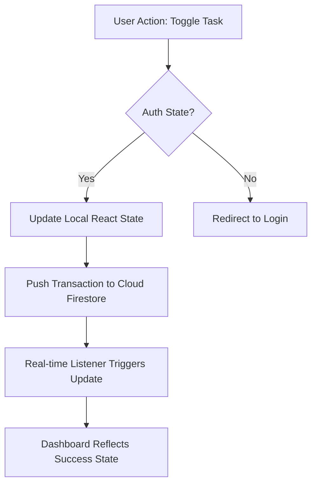

# Product Case Study: 75 Hard Elite Tracker 🏆

## 📌 Executive Summary
The **75 Hard Elite Tracker** is a premium, cloud-synced Progressive Web App (PWA) built to solve the high attrition rate of the "75 Hard" fitness challenge. By focusing on **Frictionless Onboarding**, **Data Persistence**, and **Psychological Reward Loops**, this product transforms a rigorous manual process into a digital habit-forming experience.

---

## 🏗 Product Strategy & Market Context

### The Problem: The "Persistence Gap"
Existing 75 Hard tools typically fall into two categories:
1. **Generic Habit Trackers**: Lack the specific rule enforcement (e.g., dual workouts) required by the challenge.
2. **Local-Only Web Apps**: Users lose progress when switching devices or clearing browser cache, which is devastating for a 75-day commitment.

### The Solution: A Disciplined Digital Companion
Our strategy was to build a "Discipline-as-a-Service" platform that leverages a **Serverless Architecture** to ensure progress is never lost, and a **Mobile-First UX** that fits into the user's active lifestyle.

---

## 👤 User Personas & Pain Points

| Persona | Motivation | Pain Point |
| :--- | :--- | :--- |
| **The Aspirational Disciplinarian** | Wants to build mental toughness. | Often forgets specific rules (e.g., "Must be outdoors"). |
| **The Data-Driven Athlete** | Obsessed with streaks and progress visualization. | Afraid of losing day-count data due to technical issues. |
| **The Multi-Device User** | Tracks progress on mobile but views journey on desktop. | Requires seamless cross-device synchronization. |

---

## 🎨 User Experience (UX) Architecture

### 1. The Onboarding Flow (Friction Reduction)
To reduce the "Time-to-Value," we implemented **Google OAuth**. This allows users to bypass lengthy sign-up forms and immediately begin tracking their first day.

### 2. The Engagement Loop: "Check-Complete-Celebrate"
We utilized behavioral psychology to create a **Positive Feedback Loop**:
- **Check**: Minimalist cards with animated checkboxes provide satisfying micro-interactions.
- **Complete**: A "Heroic" Complete Day button appears *only* when all criteria are met.
- **Celebrate**: Confetti animations and a state-change in the dashboard reward the user for finishing the day.

### 3. The Retention Engine (Sunk Cost Visualization)
The **Progress Grid** serves as a powerful retention tool. By visualizing the "Journey Map," we tap into the user's aversion to breaking a growing chain of successful days.

---

## 🛠 Product Workflow & System Architecture

### Key Technical Decisions:
- **PWA over Native**: To achieve **Speed-to-Market**, we chose PWA. This avoided the friction of App Store approvals while still providing a "Home Screen" presence and "Black-Translucent" status bar branding on iOS.
- **Serverless Backend (Firebase)**: Eliminated the need for managing API infrastructure, allowing the product to scale users at near-zero maintenance cost.

---

## 📊 Growth & Analytics (PM Perspective)

If scaling this product, I would focus on the following North Star Metric:
- **Challenge Completion Rate**: % of users who reach Day 75.

### Behavioral Metrics to Track:
- **D1 -> D7 Retention**: Critical for identifying early drop-off due to high challenge difficulty.
- **Checkbox Toggle Latency**: Ensuring the "Sync feeling" is instantaneous to maintain the "Elite" brand quality.

---

## 🚀 Future Roadmap
1. **Photo Verification Gallery**: Cloud Storage integration for the daily progress picture (Selfie).
2. **Social accountability Circles**: Private group leaderboards for teams doing the challenge together.
3. **Smart Water Reminders**: Push notifications triggered only if the '1 Gallon' task is incomplete by 6:00 PM.

---

**Built with discipline. Designed for outcomes.**
